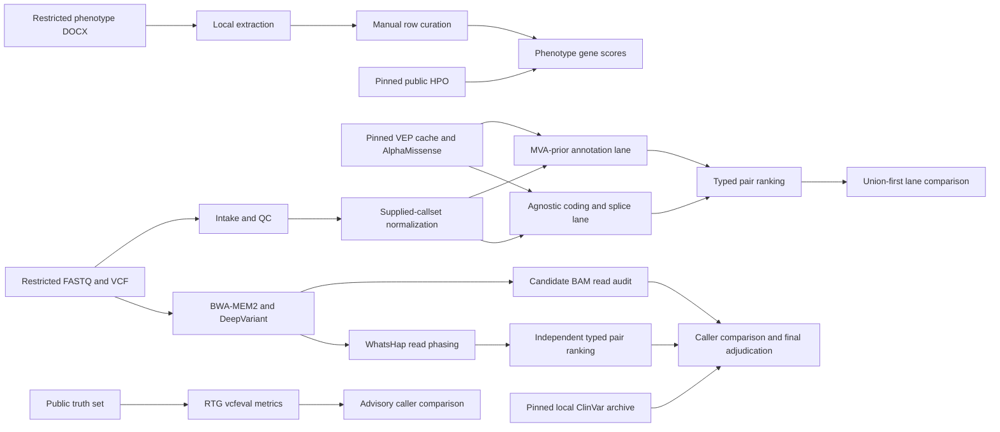

# Architecture: evidence before rank

## Objective

Produce inspectable compound-heterozygous hypotheses without hiding missing
evidence, collapsing independent algorithms into a vote, or moving patient data
outside the workstation. This is an iterative research workspace, not a
clinical pipeline or a submission system.

## Execution model

Pixi owns the reproducible software environments; Snakemake owns incremental
file dependencies; Python owns typed evidence, comparisons, and reports.
Researchers run any aggregate target directly, inspect its private artifacts,
change code/configuration or inputs, and rerun.

No node creates or uploads a challenge submission.

## Small, stable seams

`rank_case(variants, policy, proband_id)` is the central analysis interface. A
caller supplies typed, source-versioned variant evidence and a visible YAML
policy. The function returns ranked hypotheses with:

- the exact one- or two-variant hypothesis;
- per-allele quality, rarity, consequence, phenotype, mechanism, and predictor
  contributions;
- pair terms limited by the weaker allele;
- phase status and the method that established it;
- cautions for missing or low-support evidence; and
- deterministic ordering with an explicitly ordinal EPCR value.

It does not read VCFs, query remote databases, format reports, or serialize
submissions. Those concerns can change without changing pair construction.

## Phenotype model

Automatic DOCX extraction never guesses whether a row describes the proband or
family. Every row starts as `unresolved`. A researcher explicitly assigns one
of four decisions before HPO scoring:

- `proband_present`
- `proband_absent`
- `family_present`
- `family_absent`

Only reviewed proband-positive observations form the HPO query. The agnostic
phenotype score contains no MVA mechanism prior. Mechanism evidence is loaded
through a separate, opt-in field so circular disease reasoning stays visible.

## Algorithm diversity

The supplied callset, disease-prior scan, agnostic coding/splice scan, and
DeepVariant recall remain separate artifacts. Ranking comparisons start from
the union of hypotheses and preserve lane provenance. Agreement is evidence;
disagreement becomes a review queue and is never averaged away.

The supplied caller's physical `PID/PGT` blocks and WhatsHap read-backed blocks
are carried as explicit phase methods, so known-cis pairs are removed while
unphased pairs remain unresolved. AlphaMissense is kept as one neural evidence
source beside a single SIFT/PolyPhen consensus; correlated predictors are not
counted as independent votes.

The final private adjudication seam does no majority vote and assigns no
automatic ACMG/AMP classification. It follows one exact leading hypothesis
through the focused, agnostic, and recall ranks; queries a pinned full ClinVar
archive by exact GRCh38 allele identity; and joins those results to direct BAM
and WhatsHap evidence. Another nucleotide that happens to encode the same
protein change is retained as a distinct allele and cannot lend its ClinVar
classification to the candidate.

Candidate BAM inspection excludes secondary, supplementary, duplicate,
QC-failed, low-mapping-quality, and low-base-quality observations. It reports
ref/alt balance, strand, proper-pair and soft-clipping counts, mapping/base
quality, distance from read ends, and exact shared-fragment haplotypes without
persisting read names or sequences.

Public truth-set benchmarking reports TP, FP, FN, runtime, memory, incremental
rescue, and false positives per rescue. Its threshold policy is advisory. It
helps decide where an extra algorithm earns its compute cost but does not block
experimentation.

## Reproducibility without ceremony

- `pixi.lock` pins all five Linux x86-64 environments.
- `config/*.yaml` keeps policies and source versions out of code.
- Snakemake logs commands and reruns outputs whose inputs or commands changed.
- `mva manifest` remains an optional SHA-256 provenance tool for a frozen
  experiment; it is not required to prototype.
- Synthetic fixtures exercise the real workflow and executable paths.
- All private work lives under ignored `results/private/`; public references
  are versioned by manifest.

There are no approval receipts, immutable run directories, promotion gates, or
automatic submission artifacts.

## Reference and container boundaries

The source-equivalent reference was reconstructed from pinned NCBI resources.
Its manifest records contig/length comparison, REF checks, exact hashes, and a
rejected alternative. The WGS lane uses the matching reference and a
digest-pinned DeepVariant CPU image. The container receives only a read-only
reference mount, a read-only alignment mount, a writable output mount, and no
network.

## Controlled-data seam

Patient-derived records remain local. The code and tests use synthetic
fixtures. Hosted tools are limited to public literature and public challenge
material until the organizers explicitly resolve third-party processing of
patient-derived HPO terms, variants, and prompts.
